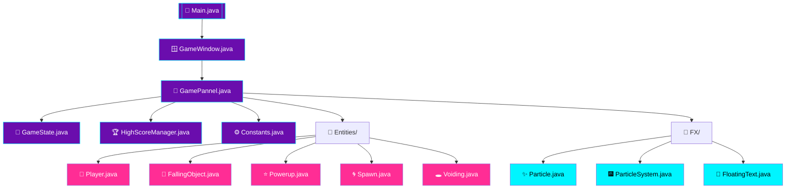
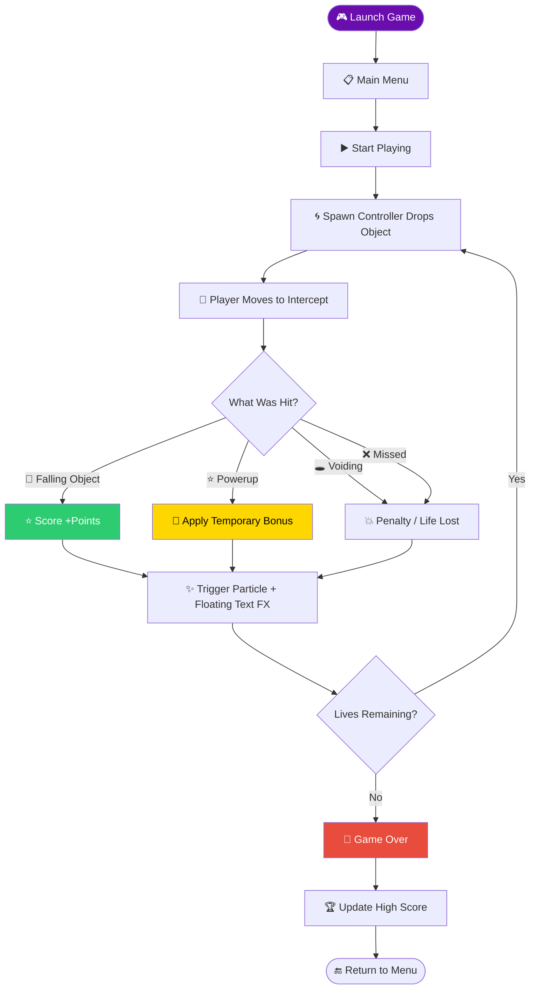
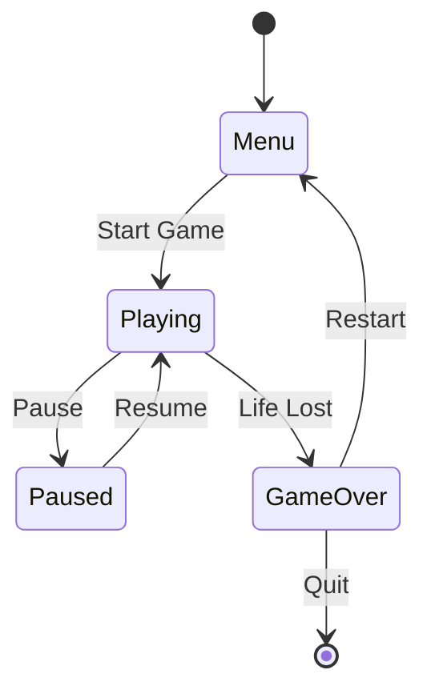

<a name="top"></a>
<div align="center">


<br/>


<br/><br/>


</div>

<br/><br/>

> **Omni-Drop Simulator** is a 2D Java arcade game where objects fall from the top of the screen and the player must react in real time — catching the good ones, dodging the dangerous ones, and grabbing power-ups along the way, all while a live particle and floating-text FX system keeps the action feeling alive.

<br/>

## ⚡ Quick Start

```bash
git clone https://github.com/Talha-Yaseen-Hub/Omni-Drop-Simulator.git
cd Omni-Drop-Simulator

# Option 1 — Run the pre-built jar (fastest)
java -jar Omni-Drop-Java-Arcade.jar

# Option 2 — Compile from source
cd Java-Arcade
javac *.java Entities/*.java FX/*.java
java Main
```

<br/>

## 📑 Table of Contents

<table>
<tr>
<td valign="top">

- [🎮 About the Game](#about-the-game)
- [📂 Repository Structure](#repository-structure)
- [📁 Project Folder](#project-folder)
- [🧩 Java Arcade — Core Files](#java-arcade--core-files)
- [🧍 Entities Folder](#entities-folder)
- [✨ FX Folder](#fx-folder)

</td>
<td valign="top">

- [🧠 Module Architecture](#module-architecture)
- [🔄 Game Loop](#game-loop)
- [🔀 Game State Machine](#game-state-machine)
- [🛠️ Tech Stack](#tech-stack)
- [🎓 Author & Academic Info](#author--academic-info)
- [📜 License](#license)

</td>
</tr>
</table>

---

<br/>

## 🎮 About the Game

Omni-Drop Simulator follows a classic arcade formula with a layer of extra polish: a **spawn controller** continuously drops different kinds of objects toward the player, who moves along the bottom of the screen to intercept them. Some drops are worth catching, some are hazards to avoid, and some are temporary power-ups — reflexes and prioritization decide the score.

Under the hood, the project is split cleanly into three concerns: **entities** (the things falling and moving on screen), **FX** (particles and floating text that make actions feel responsive), and a small set of **core controller files** that tie the window, game state, and scoring together.

<br/>

---

<br/>

## 📂 Repository Structure

```text
Omni-Drop-Simulator/
│
├── 📁 Project/
│   ├── Presentation.pptx
│   └── Proposal.pdf
│
├── 🎮 Java-Arcade/
│   ├── Constants.java
│   ├── GamePannel.java
│   ├── GameState.java
│   ├── GameWindow.java
│   ├── HighScoreManager.java
│   ├── Main.java
│   │
│   ├── 📁 Entities/
│   │   ├── FallingObject.java
│   │   ├── Player.java
│   │   ├── Powerup.java
│   │   ├── Spawn.java
│   │   └── Voiding.java
│   │
│   └── 📁 FX/
│       ├── FloatingText.java
│       ├── Particle.java
│       └── ParticleSystem.java
│
├── 📦 Omni-Drop-Java-Arcade.jar
│
└── LICENSE
```

> 💡 File purposes below are described based on standard Java game-architecture conventions and what each class name implies — since this README is generated from the file list rather than the source code itself, adjust any specifics that don't match your actual implementation.

<br/>

---

<br/>

## 📁 Project Folder

| File | Purpose |
|---|---|
| `Presentation.pptx` | Slide deck presenting the game concept, design, and outcome |
| `Proposal.pdf` | The original project proposal outlining scope and objectives |

<br/>

---

<br/>

## 🧩 Java Arcade — Core Files

| File | Role |
|---|---|
| 🚀 `Main.java` | Entry point of the application — starts the game and launches the window |
| 🪟 `GameWindow.java` | Creates and configures the application window that hosts the game |
| 🎨 `GamePannel.java` | The core game surface — handles rendering and the main update/draw loop |
| 🔄 `GameState.java` | Tracks which screen/state the game is in (menu, playing, paused, game over) |
| 🏆 `HighScoreManager.java` | Saves, loads, and compares high scores across play sessions |
| ⚙️ `Constants.java` | Central home for fixed values — screen size, speeds, spawn rates, and similar config |

<br/>

---

<br/>

## 🧍 Entities Folder

| File | Role |
|---|---|
| 🧍 `Player.java` | The player-controlled object — handles movement and collision boundaries |
| 🎯 `FallingObject.java` | The base object that falls from the top of the screen toward the player |
| ⭐ `Powerup.java` | A special drop that grants the player a temporary bonus when collected |
| 🌀 `Spawn.java` | Controls when and where new falling objects/power-ups appear |
| 🕳️ `Voiding.java` | A hazard-type drop — likely penalizes the player or removes score/lives if caught |

<br/>

---

<br/>

## ✨ FX Folder

| File | Role |
|---|---|
| ✨ `Particle.java` | A single visual particle — a spark or fragment used in effect bursts |
| 🎆 `ParticleSystem.java` | Manages groups of particles — spawning, animating, and clearing them over time |
| 💬 `FloatingText.java` | Short-lived on-screen text (e.g. a "+10" popup) that rises and fades out |

<br/>

---

<br/>

## 🧠 Module Architecture



<br/>

---

<br/>

## 🔄 Game Loop

*A plausible run-time flow based on the entity and FX classes present in the project:*



<br/>

---

<br/>

## 🔀 Game State Machine

*Reflecting the states `GameState.java` is likely responsible for tracking:*



<br/>

---

<br/>

## 🛠️ Tech Stack

<div align="center">


</div>

| Technology | Purpose |
|---|---|
| **Java** | Core application language |
| **Swing / AWT** *(inferred)* | Windowing and rendering — consistent with `GameWindow` / `GamePannel` naming |
| **Object-Oriented Design** | Entities, FX, and core systems separated into dedicated classes |
| **Custom Particle & Text FX** | `Particle`, `ParticleSystem`, and `FloatingText` provide visual feedback |

<br/>

---

<br/>

## 🎓 Author & Academic Info

<div align="center">

### Talha Yaseen

🎓 BS Information Technology &nbsp;•&nbsp; 🏫 FCIT, Punjab University &nbsp;•&nbsp; 🎮 Personal / Academic Project

<br/><br/>

<a href="mailto:talhavectorarts@gmail.com">
  
</a>
<a href="https://www.linkedin.com/in/talha-yaseen-44a41a341">
  
</a>
<a href="https://github.com/Talha-Yaseen-Hub">
  
</a>

</div>

<br/>

---

<br/>

## 📜 License

<div align="center">


<br/><br/>

This project is licensed under the **MIT License** — see the [LICENSE](./LICENSE) file for full details.

</div>

<br/><br/>

<div align="center">

[⬆ Back to Top](#top)

<br/><br/>


</div>
