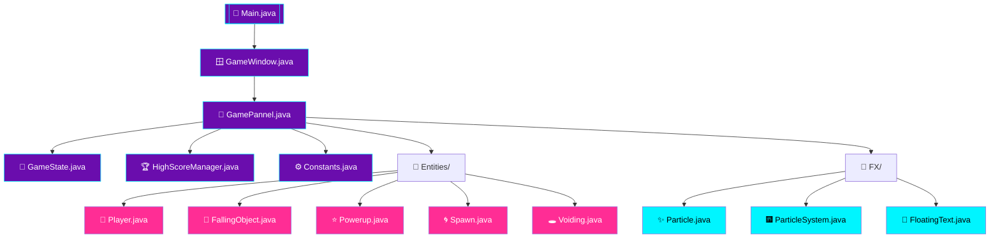
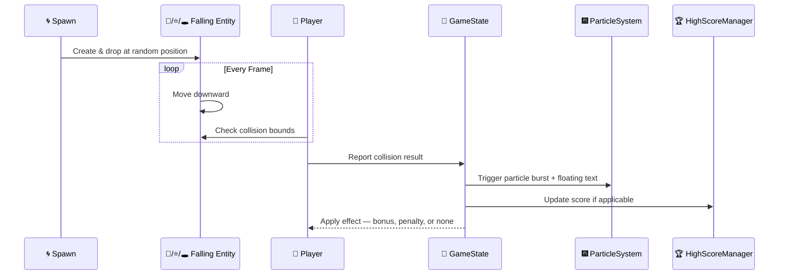
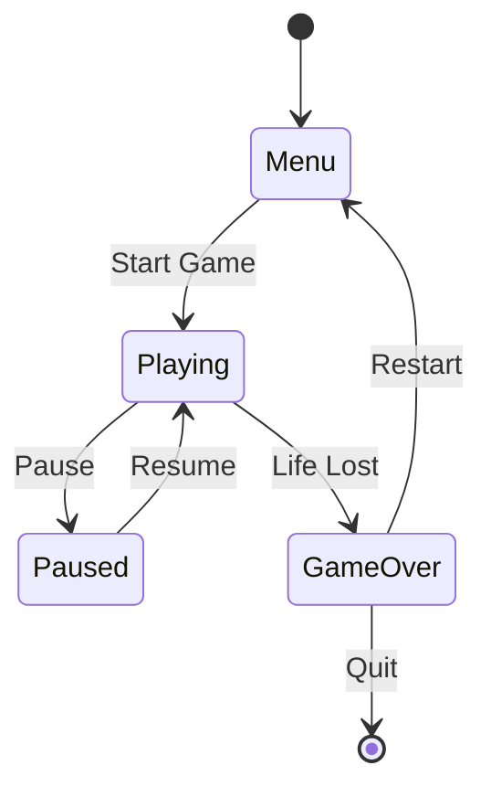

<a name="top"></a>
<div align="center">


<br/>


<br/><br/>


<br/><br/>


<br/><br/>


</div>

<br/><br/>

<div align="center">

### ⚡ Real-Time Reflex Arcade Engine

</div>

> **Omni-Drop Simulator** is a 2D Java arcade game where objects fall continuously from the top of the screen and the player must react in real time — catching the beneficial drops, dodging the dangerous ones, and grabbing power-ups along the way. A dedicated particle and floating-text FX layer keeps every catch, miss, and bonus feeling responsive rather than silent.

<br/>

## ⚡ Quick Start

**Prerequisites:** Java Development Kit (JDK 8 or newer) installed and available on your PATH.

```bash
git clone https://github.com/Talha-Yaseen-Hub/Omni-Drop-Simulator.git
cd Omni-Drop-Simulator

# Option 1 — Run the pre-built jar (fastest, no compiling needed)
java -jar Omni-Drop-Java-Arcade.jar

# Option 2 — Compile from source
cd Java-Arcade
javac *.java Entities/*.java FX/*.java
java Main
```

*(Requires only a Java Runtime to play via the `.jar`; requires a full JDK to compile from source.)*

<br/>

## 📖 Table of Contents

<details open>
<summary><b>▼ Click to expand / collapse</b></summary>

<br/>

<table>
<tr>
<td valign="top">

- [🎮 About the Game](#about-the-game)
- [✨ Key Features](#key-features)
- [📂 Repository Structure](#repository-structure)
- [📁 Project Folder](#project-folder)
- [🧩 Java Arcade — Core Files](#java-arcade--core-files)
- [🧍 Entities Folder](#entities-folder)
- [🎆 FX Folder](#fx-folder)

</td>
<td valign="top">

- [🧠 Module Architecture](#module-architecture)
- [🔁 Collision Interaction Flow](#collision-interaction-flow)
- [🔄 Game Loop](#game-loop)
- [🔀 Game State Machine](#game-state-machine)
- [🧪 What This Project Demonstrates](#what-this-project-demonstrates)
- [🛠️ Tech Stack](#tech-stack)
- [🚀 Future Enhancements](#future-enhancements)
- [🎓 Author & Academic Info](#author--academic-info)
- [📜 License](#license)

</td>
</tr>
</table>

</details>

---

<br/>

## 🎮 About the Game

Omni-Drop Simulator follows a classic arcade formula with an extra layer of polish that many beginner projects skip. A **spawn controller** continuously drops different kinds of objects toward the player, who moves along the bottom of the screen to intercept them. Some drops are worth catching for points, some are hazards that cost the player a life or score if caught, and some are temporary power-ups that shift the odds in the player's favor for a short window.

What separates this from a bare-minimum catcher game is the separation of concerns under the hood: **entities** (the things falling and moving on screen), **FX** (particles and floating text that make every action feel acknowledged), and a small set of **core controller files** that tie the window, game state, and scoring together into one coherent loop.

The result is a game that's simple to describe in one sentence, but structured the way a larger game engine would be — which is exactly what makes it a strong portfolio piece beyond just "a game that works."

<br/>

## ✨ Key Features

| | Feature | Description |
|:---:|---|---|
| 🎯 | **Catch Mechanic** | Core gameplay loop of intercepting falling objects before they reach the bottom |
| 🕳️ | **Hazard Drops** | Not every falling object helps you — some are meant to be avoided |
| ⭐ | **Power-Up System** | Temporary bonuses that reward good timing and risk-taking |
| 🌀 | **Dynamic Spawning** | A dedicated spawn controller decides what appears, when, and where |
| ✨ | **Particle FX** | Visual bursts on catches, misses, and power-up pickups |
| 💬 | **Floating Score Text** | On-screen feedback (e.g. score gained) that rises and fades |
| 🏆 | **Persistent High Scores** | Scores are saved and tracked across play sessions |
| 🔀 | **Full Game States** | Menu, active play, pause, and game-over are all handled distinctly |

<br/>

---

<br/>

## 📂 Repository Structure

```text
Omni-Drop-Simulator/
│
├── 📁 Project/
│   ├── Presentation.pptx
│   └── Proposal.pdf
│
├── 🎮 Java-Arcade/
│   ├── Constants.java
│   ├── GamePannel.java
│   ├── GameState.java
│   ├── GameWindow.java
│   ├── HighScoreManager.java
│   ├── Main.java
│   │
│   ├── 📁 Entities/
│   │   ├── FallingObject.java
│   │   ├── Player.java
│   │   ├── Powerup.java
│   │   ├── Spawn.java
│   │   └── Voiding.java
│   │
│   └── 📁 FX/
│       ├── FloatingText.java
│       ├── Particle.java
│       └── ParticleSystem.java
│
├── 📦 Omni-Drop-Java-Arcade.jar
│
└── LICENSE
```

> 💡 **A note on accuracy:** the file-by-file explanations below are built from standard Java game-architecture conventions and what each class name implies — this README was generated from your file list, not by reading the actual source code. Skim through and correct anything that doesn't match your real implementation, especially around `Voiding.java`, where the exact penalty behavior is inferred rather than confirmed.

<br/>

---

<br/>

## 📁 Project Folder

| File | Purpose |
|---|---|
| `Presentation.pptx` | Slide deck presenting the game's concept, design decisions, and final outcome |
| `Proposal.pdf` | The original project proposal — scope, objectives, and intended feature set |

<br/>

---

<br/>

## 🧩 Java Arcade — Core Files

**🚀 `Main.java`**
The entry point of the application. Its job is to initialize the game window and hand off control to it — the first and last file execution touches.

**🪟 `GameWindow.java`**
Creates and configures the top-level application window (title, size, close behavior) that hosts the actual game surface.

**🎨 `GamePannel.java`**
The heart of the game — this is almost certainly where rendering happens and where the main update-then-draw loop lives, redrawing the screen every frame based on current entity positions.

**🔄 `GameState.java`**
Tracks which screen or mode the game is currently in — menu, playing, paused, or game over — and is likely what other classes check before deciding how to behave each frame.

**🏆 `HighScoreManager.java`**
Handles reading and writing high scores, most likely to a small local file, and comparing the current run's score against the stored best.

**⚙️ `Constants.java`**
A central home for fixed configuration values — screen dimensions, fall speed, spawn intervals, colors — kept in one place instead of scattered as magic numbers throughout the codebase.

<br/>

---

<br/>

## 🧍 Entities Folder

**🧍 `Player.java`**
The player-controlled object. Handles movement input and defines the collision boundary used to detect whether a falling object has been caught.

**🎯 `FallingObject.java`**
The base "thing that falls" — likely tracks its own position, fall speed, and whether it's still active, updating its position once per frame.

**⭐ `Powerup.java`**
A special variant of a falling object that, once collected, grants the player a temporary advantage rather than direct points.

**🌀 `Spawn.java`**
The controller responsible for deciding when a new object appears, where it appears, and possibly which type it is — the piece that keeps the game's pacing interesting rather than predictable.

**🕳️ `Voiding.java`**
Based on the name, this is most likely a hazard-type drop — something the player wants to avoid rather than catch, probably costing a life, points, or triggering a negative effect on contact.

<br/>

---

<br/>

## 🎆 FX Folder

**✨ `Particle.java`**
A single visual particle — a spark, fragment, or dot with its own position, velocity, and lifespan, used as a building block for larger effects.

**🎆 `ParticleSystem.java`**
Manages a whole collection of `Particle` objects at once — spawning a burst, updating them every frame, and discarding them once they've faded.

**💬 `FloatingText.java`**
Short-lived on-screen text, like a "+10" popup, that appears at a specific point, rises upward, and fades out — the kind of small detail that makes feedback feel immediate.

<br/>

---

<br/>

## 🧠 Module Architecture



<br/>

---

<br/>

## 🔁 Collision Interaction Flow

*A plausible sequence for what happens the instant the player intercepts a drop:*



<br/>

---

<br/>

## 🔄 Game Loop


<br/>

---

<br/>

## 🔀 Game State Machine

*Reflecting the states `GameState.java` is most likely responsible for tracking:*



<br/>

---

<br/>

## 🧪 What This Project Demonstrates

- 🏗️ **Object-Oriented Design** — entities, FX, and core systems each live in their own classes with a clear single responsibility
- 🔄 **Real-Time Game Loop** — continuous update-and-render cycle running many times per second
- 🎮 **Event-Driven Input Handling** — the game reacts to player input as it happens, not on a delay
- 🔀 **State Management** — menu, play, pause, and game-over are handled as distinct, well-defined states
- ✨ **Feedback-Driven UX** — particles and floating text turn silent logic (a score increment) into something the player actually notices
- 📁 **Maintainable Structure** — splitting code by concern (entities vs. FX vs. core) instead of one large file

<br/>

---

<br/>

## 🛠️ Tech Stack

<div align="center">


</div>

| Technology | Purpose |
|---|---|
| **Java** | Core application language |
| **Swing / AWT** *(inferred)* | Windowing and rendering — consistent with `GameWindow` / `GamePannel` naming |
| **Object-Oriented Design** | Entities, FX, and core systems separated into dedicated classes |
| **Custom Particle & Text FX** | `Particle`, `ParticleSystem`, and `FloatingText` provide visual feedback |

<br/>

---

<br/>

## 🚀 Future Enhancements

- [ ] Additional power-up types with distinct visual identities
- [ ] Progressive difficulty scaling (faster spawns, more hazards over time)
- [ ] Sound effects and background music
- [ ] An online or local leaderboard beyond a single high score
- [ ] Configurable controls / key remapping
- [ ] Packaged, cross-platform executable beyond the runnable `.jar`

<br/>

---

<a id="author"></a>
<div align="center">


## 👨‍💻 Author

## Talha Yaseen

*Roll: BITF24M041*

*BS Information Technology*

Omni Drop Java Arcade Academic Project

### Connect with Me

- 🌐 GitHub: **[github.com/Talha-Yaseen-Hub](https://github.com/Talha-Yaseen-Hub)**
- 💼 LinkedIn: **[linkedin.com/in/talha-yaseen](https://www.linkedin.com/in/talha-yaseen-44a41a341)**
- 📧 Email: **talhavectorarts@gmail.com**

<br>


</div>

<div align="right"><a href="#top">⬆️ Back to Top</a></div>

---

<br/>

## 📜 License

<div align="center">


<br/><br/>

This project is licensed under the **MIT License** — see the [LICENSE](./LICENSE) file for full details.

</div>

<br/><br/>

<div align="center">

[⬆ Back to Top](#top)

<br/><br/>


</div>

---

<a id="support"></a>
<div align="center">

# ⭐ Support

If this repository helped you during your semester, consider giving it a **⭐ Star** on GitHub.

Your support encourages me to continue organizing and sharing educational resources with the student community.

<br>

### 🚕 Happy Learninng!

### 🌟 *"Catch the light, dodge the void. Thanks for dropping by ☄️."*

<br>


</div>
